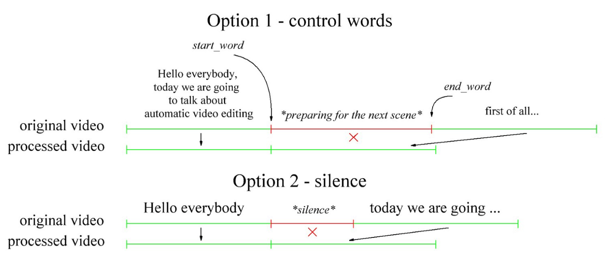

# Auto video editing 

This project is inspired by the excelent article from *Dmytro Nikolaiev* *Automatic Video Editing using Python*. The goal of this project is to automatically cut some video fragments and then join these fragments together, as well to provide additional commands that allows you to merge different videos. 

It has to receive data about these fragments in two ways:

- Automated (partially automatic, with some human intervention) — recognizing control words, and
- Automatic (completely automatic, without human intervention) — identifying long moments of silence



## Prepare Development Machine 

Run the `./build/prepare_machine.sh`

This will install: 

- Python3: Runtime
- Pip3: Package Manager
- MoviePy Python API: Video Editor 
- Vosk Python API: Speech Recognintion

## How to Compile

From this folder execute:

```shell
docker-compose -f ./build/docker-compose.yaml build
```

## How to Run

From this folder execute:

```shell
docker-compose -f ./build/docker-compose.yaml up -d
```

Than you can connect in the following URL. The Swagger documentation will be displayed:

[http://localhost:8000](http://localhost:8000)

## Reference

- [Automatic Video Editing using Python by Dmytro Nikolaiev (Dimid)](https://towardsdatascience.com/automatic-video-editing-using-python-324e5efd7eba)
